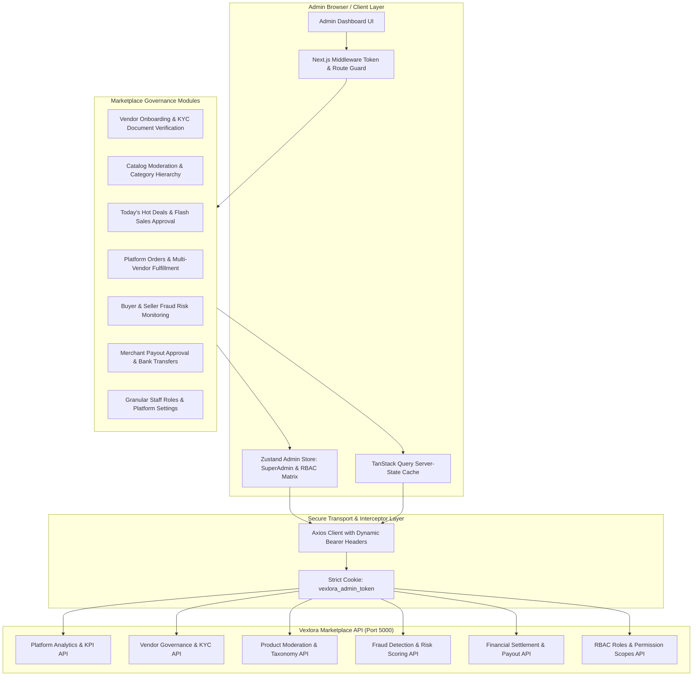

# Vexlora — Platform Administration & Governance Portal

[](https://nextjs.org/)
[](https://react.dev/)
[](https://www.typescriptlang.org/)
[](https://tailwindcss.com/)
[](https://tanstack.com/query)
[](https://zustand-demo.pmnd.rs/)

**Vexlora Admin Panel** is the core platform operations, governance, and marketplace management system for the Vexlora multi-vendor e-commerce platform. Built on **Next.js App Router**, **React 19**, **TypeScript**, and **Tailwind CSS v4**, this application gives platform administrators and super administrators control over merchant onboarding and KYC approvals, catalog moderation, platform-wide orders, deals curation, fraud risk detection, vendor payout settlements, and enterprise RBAC permissions.

---

## 🏗️ Platform Administration Architecture



---

## ✨ Implemented Platform Features

### 📈 Executive Platform Analytics (`/`)
* **Gross Marketplace Value (GMV)**: Real-time tracking of platform-wide sales volume, collected platform commissions, total orders, and active merchant counts.
* **Order Status Breakdown**: Visual distribution of order volumes across lifecycle stages (`PENDING`, `PROCESSING`, `SHIPPED`, `DELIVERED`, `CANCELLED`).
* **Recent System Activity**: Live log of new vendor applications, large-value orders, and critical platform alerts.

### 🏢 Vendor Onboarding & KYC Governance (`/vendors`)
* **Vendor Application Review Queue**: Review incoming seller registrations with store details, business contact, and bank settlement accounts.
* **KYC Document Verification**: In-app preview and audit of merchant legal documentation (trade licenses, tax certificates/TIN, business registration).
* **Approval & Rejection Lifecycle**: Single-click approval granting instant vendor portal access, or rejection with structured feedback notes.
* **Merchant Lifecycle Management**: Suspend, reactivate, or audit existing vendor accounts.

### 🛡️ Product Catalog Moderation & Taxonomies (`/products`, `/categories`)
* **Global Product Catalog**: Filterable platform product inventory with multi-vendor attribution, category sorting, and price/stock filters.
* **Moderation Pipeline**: Review pending vendor product submissions, approve compliant listings, or reject substandard products.
* **Category & Taxonomy Builder (`/categories`)**: Create and manage hierarchical categories and subcategories with custom slugs, SVG iconography, and display sort orders.

### 🔥 Promotions, Deals & Campaigns (`/deals`, `/coupons`)
* **"Today's Hot Deals" Curation (`/deals`)**: Review vendor flash sale proposals, verify discount thresholds, and publish curated deals to the customer website homepage.
* **Global Platform Coupons (`/coupons`)**: Create and administer sitewide promotional vouchers with discount caps, minimum cart thresholds, start/expiration dates, and usage limits.

### 📦 Platform Order Oversight (`/orders`)
* **Global Order Stream**: Comprehensive ledger of all marketplace transactions across all registered vendors.
* **Multi-Vendor Breakdown**: Inspect multi-store split shipments within single customer orders with direct tracking and status inspection.

### 👥 User & Customer Management (`/users`)
* **User Directory**: Searchable list of registered customers, sellers, and administrators with registration dates, verified statuses, and roles.
* **Account Enforcement**: Update user account statuses (`ACTIVE`, `SUSPENDED`, `BANNED`) to protect platform integrity.

### 🚨 Fraud & Risk Monitoring Engine (`/fraud`)
* **Buyer & Seller Fraud Risk Profiles**: Track suspicious buyer accounts, excessive refund velocity, and high-risk sellers.
* **Risk Score Assessment**: Dynamic risk scoring visualizing dispute rates, suspicious IP/session trends, and chargeback signals.
* **Audit Actions**: Manual risk profile overrides, blacklisting, and account lockouts.

### 💳 Vendor Payout Settlement (`/payouts`)
* **Withdrawal Request Queue**: Review merchant withdrawal requests against available account balances and bank records.
* **Settlement Execution**: Approve payouts with banking reference numbers, or reject requests with audit feedback.
* **Disbursement History**: Complete transaction log of all historical platform disbursements.

### 🔐 Enterprise RBAC & Staff Governance (`/roles`)
* **Role Hierarchy**: Strict separation between `SUPER_ADMIN`, `ADMIN`, and custom staff roles.
* **Granular Permission Matrix**: Create custom roles with tailored permission strings (e.g., `vendors:approve`, `products:moderate`, `payouts:process`, `fraud:audit`).

### ⚙️ Platform Settings & Policies (`/settings`)
* **Marketplace Commission Configuration**: Adjust baseline commission rates across platform categories.
* **Platform Security**: Configure session expiry thresholds and global operational parameters.

---

## 🔄 Vendor Approval & Governance Workflow

```
[ Step 1: Merchant Applies ]
  Prospective vendor registers via `/vendor-apply` and submits KYC legal documents.
        │
[ Step 2: Admin Queue Inspection ]
  Admin navigates to `/vendors` → Filter by status: `PENDING`.
        │
[ Step 3: KYC & Document Review ]
  Admin inspects trade license, tax ID documents, bank details, and store branding.
        │
[ Step 4: Decision Execution ]
  ├── [ Approve ]: Status updated to `APPROVED` → Merchant receives dashboard access.
  └── [ Reject ]: Status updated to `REJECTED` with administrative reason logged.
        │
[ Step 5: Ongoing Governance ]
  Monitor merchant fraud scores, handle customer escalations, or suspend on policy violations.
```

---

## 🛡️ Administrative Security & Access Control

```
                                [ Admin Navigation ]
                                         │
                          Next.js Middleware Interceptor
                     Cookie: `vexlora_admin_token` present?
                                ├── No ───> Redirect to `/login`
                                └── Yes ──> Allow Route Access
                                                 │
                                     Zustand Store Check
                                       Fetch `/users/me`
                                                 │
                             Role in ['ADMIN', 'SUPER_ADMIN']?
                                ├── No ───> Purge Tokens & Cookies
                                │           Display "Access Denied"
                                └── Yes ──> Hydrate Profile & Permissions
                                                 │
                                   Evaluate Resource Permission
                                     `hasPermission('vendors:approve')`
                                ├── Denied ──> Disable Action / Hide Button
                                └── Granted ─> Allow Operation
```

* **Token Isolation**: Uses `vexlora_admin_token` cookie and local storage key, completely isolated from customer and merchant tokens.
* **Strict Admin Role Verification**: Any non-admin token is immediately rejected and purged from browser storage.
* **Super Admin Wildcards**: Users with the `SUPER_ADMIN` role or `*` permission bypass individual capability checks.

---

## ⚙️ Frontend Engineering & Data Architecture

### 1. TanStack Query Server-State Caching
* Domain hooks (`useAdminVendors`, `useAdminProducts`, `useAdminOrders`, `useAdminPayouts`, `useAdminFraud`) manage background data fetching, window refetching, and targeted query invalidation.

### 2. High-Performance Dashboard Tables
* Standardized table layouts with dynamic column sorting, pagination controls, facet filters, and row action modals.

### 3. Asynchronous User Feedback
* Integrated **Sonner** toast feedback for all administrative actions (vendor approval, product moderation, role assignment, payout settlement).
* Built-in skeleton screens and error boundaries prevent layout shifts during network fetches.

---

## 📋 Comprehensive Testing & Verification Matrix

| Feature / Flow | Test Scenario | Expected Result | Status |
| :--- | :--- | :--- | :--- |
| **Admin Login** | Login with valid administrator credentials | `vexlora_admin_token` stored, store hydrated, redirects to `/` | **Verified (Manual E2E)** |
| **Role Restriction** | Login with Customer or Vendor account | Denied with "Access denied. Admin role required" error | **Verified (Manual E2E)** |
| **Unauthenticated Route Guard** | Direct browser access to `/vendors` without token | Next.js Middleware intercepts; redirects immediately to `/login` | **Verified (Manual E2E)** |
| **Vendor KYC Approval** | Admin reviews pending vendor and clicks "Approve" | Status updates to `APPROVED`; vendor unlocked in platform | **Verified (Manual E2E)** |
| **Vendor Rejection** | Admin rejects application with reason note | Status updates to `REJECTED`; reason recorded in audit log | **Verified (Manual E2E)** |
| **Product Moderation** | Admin approves pending product submission | Product status set to `ACTIVE`; appears on customer website | **Verified (Manual E2E)** |
| **Category Creation** | Create parent category with slug and icon | Category saved and reflects in platform taxonomy tree | **Verified (Manual E2E)** |
| **Deal Curation** | Admin approves vendor deal for "Hot Deals" | Deal published to public deals carousel on customer website | **Verified (Manual E2E)** |
| **Coupon Generation** | Create platform-wide voucher with min spend | Voucher created and available for customer checkout | **Verified (Manual E2E)** |
| **Payout Approval** | Approve pending vendor withdrawal request | Payout marked `PROCESSED`; transaction reference recorded | **Verified (Manual E2E)** |
| **Fraud Risk Override** | Flag suspicious seller profile in `/fraud` | Risk level updated; vendor flagged for enhanced monitoring | **Verified (Manual E2E)** |
| **RBAC Permission Gate** | Admin without `payouts:approve` opens payouts | Action buttons disabled or hidden based on `hasPermission` | **Verified (Manual E2E)** |
| **Admin Logout** | Click logout from user profile dropdown | Purges cookies and localStorage; redirects to `/login` | **Verified (Manual E2E)** |
| **TypeScript Integrity** | Run `pnpm typecheck` | 0 diagnostic compiler errors across all admin pages | **Verified (Automated)** |
| **ESLint Compliance** | Run `pnpm lint` | 0 linter violations across all TSX components | **Verified (Automated)** |

---

## 🧰 Tech Stack

| Technology | Purpose | Implementation Path |
| :--- | :--- | :--- |
| **Next.js 16.3.5** | App Router, Server Middleware & Port 3002 Routing | [`src/app/`](src/app), [`src/middleware.ts`](src/middleware.ts) |
| **React 19.2.8** | Component Architecture & Server Components | Core dependency |
| **TypeScript 5.x** | Static Type Safety & Shared Types | [`src/types/`](src/types) |
| **Tailwind CSS v4** | Clean Governance Dashboard Styling | [`src/app/globals.css`](src/app/globals.css) |
| **TanStack Query v5** | Server-State Caching, Polling & Invalidation | [`src/hooks/`](src/hooks) |
| **Zustand v5** | Admin Session & RBAC Permissions Store | [`src/stores/useAdminStore.ts`](src/stores/useAdminStore.ts) |
| **React Hook Form** | Form State Management | Settings & Category forms |
| **Zod v4** | Runtime Schema Validation | Form validation schemas |
| **Axios** | HTTP Client with Dynamic Authorization Headers | [`src/lib/api-client.ts`](src/lib/api-client.ts) |
| **Lucide React** | Dashboard & Governance Iconography | Shared across navigation & tables |
| **Sonner** | Interactive Notification Toasts | Root layout provider |

---

## 📁 Project Structure

```text
vexlora-admin/
├── src/
│   ├── app/
│   │   ├── (auth)/                  # Admin authentication routes
│   │   │   └── login/               # Administrator sign-in
│   │   ├── (dashboard)/             # Protected governance dashboard routes
│   │   │   ├── categories/          # Category & taxonomy hierarchy management
│   │   │   ├── coupons/             # Platform-wide promotional coupon campaigns
│   │   │   ├── deals/               # Deals curation & Flash Sale approvals
│   │   │   ├── fraud/               # Buyer & seller fraud risk monitoring
│   │   │   ├── notifications/       # Platform alert notifications
│   │   │   ├── orders/              # Platform-wide order oversight
│   │   │   ├── payouts/             # Vendor payout request settlement
│   │   │   ├── products/            # Catalog moderation & product status
│   │   │   ├── profile/             # Administrator profile management
│   │   │   ├── roles/               # Enterprise RBAC role & permission manager
│   │   │   ├── settings/            # Platform commission & security settings
│   │   │   ├── users/               # Customer & user account management
│   │   │   ├── vendors/             # Vendor application KYC review & approvals
│   │   │   ├── layout.tsx           # Dashboard layout shell with sidebar & header
│   │   │   └── page.tsx             # Executive GMV & platform analytics overview
│   │   ├── layout.tsx               # Root layout & TanStack Query provider
│   │   └── globals.css              # Governance theme styling tokens
│   ├── components/                  # Reusable data tables, modals, badges, inputs
│   ├── hooks/                       # Domain hooks (useAdminVendors, useAdminFraud, useAdminPayouts)
│   ├── lib/                         # API client & shared utilities
│   ├── middleware.ts                # Next.js route guard for admin token
│   ├── stores/                      # Zustand admin state (useAdminStore)
│   └── types/                       # TypeScript definitions (auth, vendors, fraud, orders)
├── package.json
└── tsconfig.json
```

---

## 🌟 Engineering Highlights

1. **KYC Document Verification Pipeline**: Built an administrative audit interface allowing document inspection (trade licenses, tax certificates, bank info) before granting seller access.
2. **Dynamic Fraud & Risk Dashboard**: Visualized buyer and seller risk scoring, dispute frequencies, and abnormal transaction behaviors with one-click administrative lockouts.
3. **Hierarchical RBAC Permission Matrix**: Granular authorization engine allowing Super Admins to define custom staff roles with fine-grained functional scopes (e.g. `vendors:approve`, `payouts:process`).
4. **Platform Deal Curation Engine**: Workflow for moderating vendor-submitted discount campaigns and promoting them directly to the public marketplace homepage.
5. **Strict Multi-Tenant Session Isolation**: Independent cookie and storage token management preventing cross-tenant privilege escalation across the marketplace ecosystem.

---

## 🚀 Getting Started

### Prerequisites
* **Node.js**: `v20.x` or higher
* **pnpm**: `v10.x` or higher
* **Backend API**: Running instance of `e-commerce-backend` on port `5000`

### 1. Install Dependencies
```bash
pnpm install
```

### 2. Configure Environment
Create a `.env.local` file in the root directory:
```env
NEXT_PUBLIC_API_URL=http://localhost:5000/api/v1
NEXT_PUBLIC_AUTH_URL=http://localhost:5000/api/v1/auth
```

### 3. Run Development Server
```bash
pnpm dev
```
The Admin Panel runs on [http://localhost:3002](http://localhost:3002).

### 4. Code Quality & Build Checks
```bash
# Typecheck
pnpm typecheck

# Lint
pnpm lint

# Production Build
pnpm build
```
